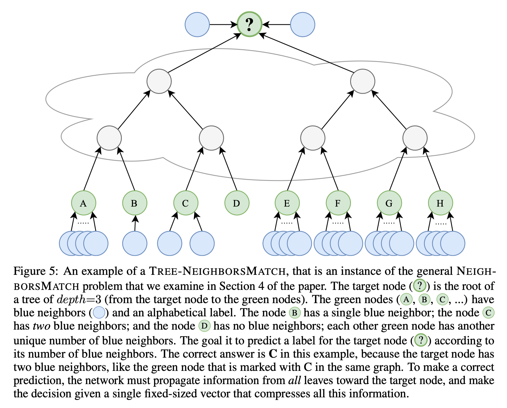
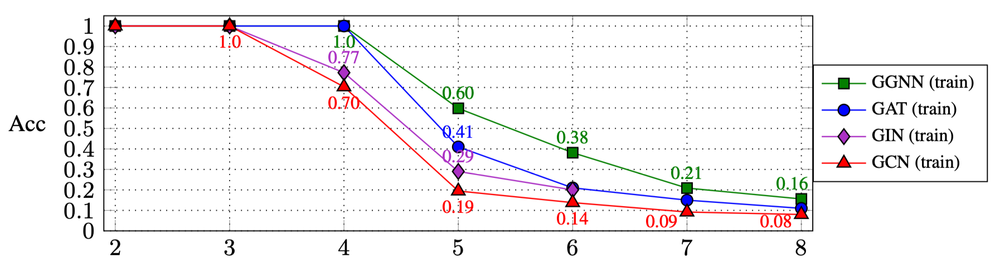

# On the Bottleneck of Graph Neural Networks and its Practical Implications

This is the official implementation of the paper: [On the Bottleneck of Graph Neural Networks and its Practical Implications](https://arxiv.org/pdf/2006.05205) 

See also [[video]](https://youtu.be/vrLsEwzZTCQ)[[slides]](https://urialon.cswp.cs.technion.ac.il/wp-content/uploads/sites/83/2020/07/bottleneck_slides.pdf). 

This repository can be used to reproduce the experiments of 
Section 4.1 in the paper, for the "Tree-NeighborsMatch" problem. 
It also allows comparing other GNN architectures in the same problem.


# The Tree-NeighborsMatch problem


## Requirements

### Dependencies
This project is based on PyTorch 1.4.0 and the [pytorch_geometric](https://pytorch-geometric.readthedocs.io/) library.
First, install PyTorch 1.4.0 from the official website: [https://pytorch.org/](https://pytorch.org/).

The `requirements.txt` lists the additional requirements.
 However, pytorch_geometric might requires manual installation, and we thus recommend to use the 
`requirements.txt` file only afterward.

Install the needed dependencies for pytorch_geometric, with ${CUDA} replaced by either:
`cpu`, `cu92`, `cu100` or `cu101` depending on your PyTorch installation.
For example, set:
```
CUDA=cu101
```
To specify CUDA 10.1.
Then, run:
```
$ pip install torch-scatter==latest+${CUDA} -f https://pytorch-geometric.com/whl/torch-1.4.0.html
$ pip install torch-sparse==latest+${CUDA} -f https://pytorch-geometric.com/whl/torch-1.4.0.html
$ pip install torch-cluster==latest+${CUDA} -f https://pytorch-geometric.com/whl/torch-1.4.0.html
$ pip install torch-spline-conv==latest+${CUDA} -f https://pytorch-geometric.com/whl/torch-1.4.0.html
$ pip install torch-geometric
``` 

If the last line (`pip install torch-geometric`) doesn't work, you can try to clone the repository [https://github.com/rusty1s/pytorch_geometric](https://github.com/rusty1s/pytorch_geometric), and run:

```
python setup.py install
```

Eventually, run the following to verify that all dependencies are satisfied:
```setup
pip install -r requirements.txt
```

Addtionally, verify that importing the dependencies goes without errors:
```
python -c 'import torch; import torch_geometric'
```

If the installation of pytorch_geometric ends with errors, see: [https://pytorch-geometric.readthedocs.io/en/latest/notes/installation.html](https://pytorch-geometric.readthedocs.io/en/latest/notes/installation.html) 

### Hardware
Training on large trees (depth=8) might require ~60GB of RAM and about 10GB of GPU memory.
GPU memory can be compromised by using a smaller batch size and using the `--accum_grad` flag.

For example, instead of running:
```
python main.py --batch_size 1024 --type GGNN
```

The following uses gradient accumulation, and takes less GPU memory:
```
python main.py --batch_size 512 --accum_grad 2 --type GGNN
```

## Reproducing Experiments

To run a single experiment from the paper, run:

```
python main.py --help
```
And see the available flags.
For example, to train a GGNN with depth=4, run:
```
python main.py --task DICTIONARY --eval_every 1000 --depth 4 --num_layers 5 --batch_size 1024 --type GGNN
```  

To train a GNN across all depths, run one of the following:
```
python run-gcn-2-8.py
python run-gat-2-8.py
python run-ggnn-2-8.py
python run-gin-2-8.py
```

## Results

The results of running the above scripts are (Section 4.1 in the paper):





Depth:   | 2   	| 3   	| 4    	| 5    	| 6    	| 7    	| 8    	|
------	|-----	|-----	|------	|------	|------	|------	|------	|
 **GGNN** 	| 1.0 	| 1.0 	| 1.0  	| 0.60 	| 0.38 	| 0.21 	| 0.16 	|
 **GAT**  	| 1.0 	| 1.0 	| 1.0  	| 0.41 	| 0.21 	| 0.15 	| 0.11 	|
 **GIN**  	| 1.0 	| 1.0 	| 0.77 	| 0.29 	| 0.20 	|      	|      	|
 **GCN**  	| 1.0 	| 1.0 	| 0.70 	| 0.19 	| 0.14 	| 0.09 	| 0.08 	|
